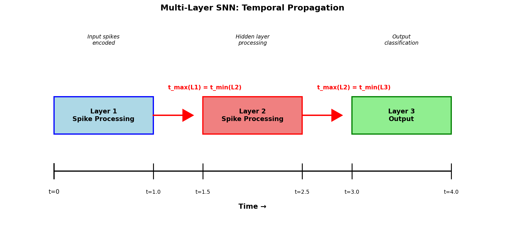

ReLU to SNN Conversion on MNIST

Converting trained ReLU networks to spiking neural networks using time-to-first-spike encoding.

**Results**
Trained networks at different depths (2, 4, 6, 8 layers) to ~98% training accuracy, then converted to SNNs and tested on 1000 MNIST samples:

| Layers | ReLU Acc | SNN Acc | Drop 
|--------|----------|---------|------|
| 2      | 96.10%   | 96.40%  | -0.30% |
| 4      | 94.20%   | 95.60%  | 1.20% |
| 6      | 96.10%   | 93.10%  | 1.60% |
| 8      | 96.80%   | 91.20%  | 3.30% |

Depth Comparison


The conversion works well for shallow networks but accuracy drops increase with depth.

## How the conversion works

The basic idea is to convert ReLU activations into spike times - higher activation means earlier spike time.



```
For each layer:
- Input activities get mapped to spike times: t = 1 - x (normalized to [0,1])
- Threshold: V = t_max - bias - sum(weights)  
- Output spike time: t_out = V / current
- Decode back: output = t_max - t_out
```

## Spike time behavior

Looking at how spike times are distributed across layers shows why deeper networks lose accuracy:


## Files Usage

1. **Train networks**  
   `python train_mnist_pytorch.py`  
   Train 2, 4, 6, 8-layer ReLU networks on MNIST.
2. **Convert trained models to SNN**  
   `python convert_all_models.py`  
   Convert trained models to SNNs and evaluate.
3. **Generate plots**  
   `python create_plot.py`  
   Generate depth vs accuracy comparison plot.
4. **Verify numerical exactness**  
   `python stability_analysis.py`  
   Verify conversion precision on 2-layer network.


**Requirements:**
pip install numpy torch torchvision matplotlib  

**What I learned**  
The conversion maintains pretty good accuracy for 2-4 layer networks (drops under 1.5%), but deeper networks show larger drops (3%+ for 8 layers). This seems to be related to how spike times behave across multiple layers - they tend to cluster which reduces numerical precision.

**Acknowledgments:** 
Developed under the guidance of Prof. Guillaume Bellec.


